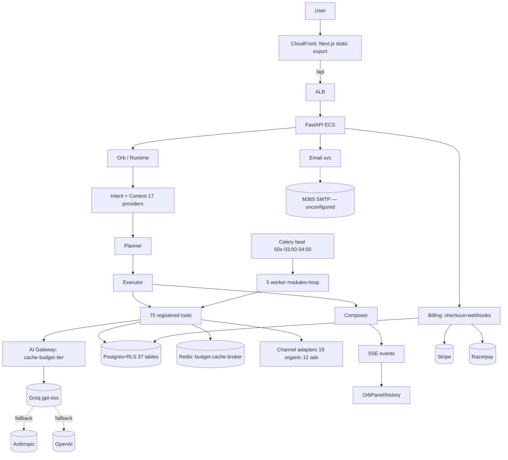
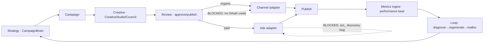
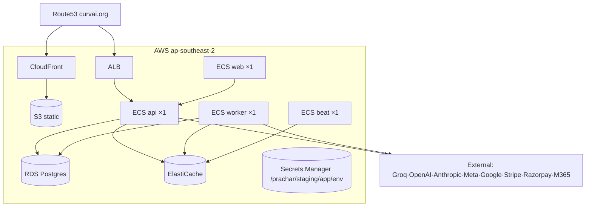

# CURV AI — Production Readiness Report

**Date:** 2026-10-06 · **Executive Verdict: 🟡 READY AFTER CONFIGURATION**
*(+ one ~½-day Meta engineering fix for paid ads)*

---

## 1. What CURV AI actually is today

A production-deployed AI marketing-intelligence platform: Next.js 15 static export (CloudFront) → FastAPI (ECS) → Postgres+RLS / Redis / Celery. A real agentic runtime (Orb → Intent → Context → Planner → 75 tools → Executor → Composer → SSE) drives a 10-engine Campaign Brain, a 9-director Agency Council, conversational brand onboarding, RAG knowledge search, and a 10-format creative studio — all billed per-plan with atomic Redis ledger + DB mirror.

## 2. What intelligence is real — verified

Every claim below was live-probed or code-traced on staging, not inferred from docs:

| Intelligence | Evidence |
|---|---|
| Orb chat → real LLM reply | `runtime.session.completed` + `chat.respond.completed` live |
| Context engine | `context.build.evaluated` events, 17 providers |
| Campaign Brain | `consult` chains extract→understand→brain.analyse→plan — real prompts, real completions |
| Agency Council | 9 directors + weighted consensus engine (code + 189 tests) |
| RAG | OpenAI `text-embedding-3-small` (key set) → `knowledge_embeddings` → cosine search |
| Creative Studio | 10-format LLM generation + regenerate-field |
| Learning/loop | weekly measure→diagnose→regenerate→policy→publish→realloc→report chain fires |
| Budget governance | atomic Lua reserve/settle; `AI_BUDGET_EXCEEDED` propagates end-to-end |

**Not intelligence-by-LLM-buzzword:** the planner selects tools, the executor runs them against real adapters/DB, the composer narrates real events, and everything is RLS-scoped and billed.

## 3. What is connected

Orb/Runtime/SSE/chat-history · auth (PyJWT, refresh) · brands/campaigns/review/reports · knowledge · billing (checkout+webhooks+ledger) · workers/beat · observability · CORS/RLS/injection-guard. All verified live post-deploy.

## 4. What is dormant

Channel publishing (adapters complete, zero connections), ads lifecycle, GA4/HubSpot/Mailchimp/Shopify/WordPress classes, tier-3 regional channels, `apps/ai-gen` Modal svc, `apps/web` legacy frontend.

## 5. What is broken

1. ~~4 dead frontend routes~~ — **FIXED TODAY** (`?brand_id=` filter, `/campaigns/{id}/budget`, `/brands/{id}/content`, reports path + download URL). 10 regression tests green.
2. Meta ad-account discovery reads `act_{id}` from scopes that never contain it → silent fake campaign ids (B5).
3. Meta long-lived-token exchange absent (I1).

## 6. What requires credentials

| Gap | Where creds exist | Action |
|---|---|---|
| `FAL_KEY`, `GEMINI_API_KEY` (media gen) | local `.env` SET | sync → AWS secrets |
| `GOOGLE_*`, `META_*`, `LINKEDIN_*`, `X_*`, `WHATSAPP_*`, `TELEGRAM_*`, `LINE_*` (OAuth) | local `.env` SET | sync → AWS secrets |
| `STRIPE_WEBHOOK_SECRET`, `RAZORPAY_WEBHOOK_SECRET` | **nowhere — generate** | dashboard → secrets |
| `SMTP_*` + `EMAIL_FROM` (email) | M365 mailbox exists | configure app password |
| `OPENAI_API_KEY` (RAG) | **already on staging** | — |
| Tier-3 channels + all other ads networks | nowhere | register apps (post-launch) |

## 7. What requires engineering

| Item | Size | Why |
|---|---|---|
| Meta ad-account discovery (`/me/adaccounts` → Connection metadata) | ~½ day | without it, paid ads silently fake |
| Meta `fb_exchange_token` long-lived flow | ~½ day | token longevity |
| Remove silent-MOCK fallbacks on API error (content page) | ~1 h | honesty of UI |
| Retire `apps/web` + retarget Makefile/compose | ~1 h | hygiene, not function |

**Total engineering to launch-grade: ~1.5 days.** Everything else is credential ops.

## 8. Public launch minimum

See `CURV_AI_PUBLIC_LAUNCH_SCOPE.md` — MUST HAVE = AI brain + campaign intelligence + creative gen + media gen + Meta/Google publishing + Meta Ads + billing + email + automation. All achievable.

## 9. Launch blockers

See `CURV_AI_LAUNCH_BLOCKERS.md` — **B1 media creds · B2 OAuth creds · B3 webhook secrets · B4 email SMTP · B5 Meta act-discovery.** Zero architectural work.

## 10. Recommended activation order

1. Sync local creds → AWS `/prachar/staging/app/env` (media + OAuth) → force ECS redeploy.
2. M365 SMTP (`founder@curvai.org`) → `SMTP_*` + `EMAIL_FROM`.
3. Generate webhook secrets in Stripe/Razorpay dashboards → secrets + register endpoints.
4. Fix Meta `act_` discovery + `fb_exchange_token`.
5. Live E2E: signup→connect→campaign→publish→metrics→billing.

## 11. Decommission candidates

See `CURV_AI_DECOMMISSION_PLAN.md` — `apps/web` (deprecate), `apps/ai-gen` (deprecate), empty `apps/api/routers/` + `apps/workers/{ads,organic,...}` (remove).

## 12. Architecture diagram



## 13. Intelligence diagram

```mermaid
flowchart LR
    MSG[User msg] --> INV[/runtime/invoke]
    INV --> TM[TenantMiddleware · RLS]
    TM --> INT[IntentEngine]
    INT --> CB[ContextBuilder · 17 providers]
    CB --> PLN[Planner]
    PLN --> G[ExecutionGraph] --> EXE[ExecutionEngine]
    EXE --> T1[tools: brain·council·knowledge·creative·channel]
    T1 --> GW[AI Gateway: reserve→call→settle]
    GW --> LLM[Provider models]
    EXE --> EV[EventBus → runtime_events]
    EV --> CMP[Composer]
    CMP --> SSE2[SSE → OrbPanel]
    EV --> HIST[/runtime/sessions → chat history]
    GW --> BUD[Redis budget + DB mirror]
    BEAT2[Beat: dispatch_due·perf·anomaly] --> T1
```

## 14. Execution diagram



## 15. Infrastructure diagram



## 16. Risk register

| Risk | Likelihood | Impact | Mitigation |
|---|---|---|---|
| Paid activation without webhook secrets → silent non-entitlement | high until B3 | high | B3 first in order |
| Meta fake campaign ids (no acct discovery) | certain if launched | high | B5 fix |
| Channel tokens expire (no refresh) | certain ~60d | medium | I1 |
| Single-LLM dependency (Groq) | medium | medium | I2 verify fallbacks |
| Silent-MOCK UI masks outages | medium | low | I4 |
| `apps/web` stale vulns | low | low | I5 |

## 17. Final CTO assessment

CURV AI is **not a demo — it's a real intelligence platform with unplugged peripherals.** The brain (runtime, engines, council, RAG, budget governance, automation) is production-grade and verified. What remains is **credential logistics** (~30 minutes of secret syncing), **one small engineering fix** (Meta ad-account discovery), and **one email env block** — not architecture. The frozen architecture is sound; do not redesign. The honest verdict: **🟡 READY AFTER CONFIGURATION** — estimated effort: ~1.5 engineering days + credential ops.
